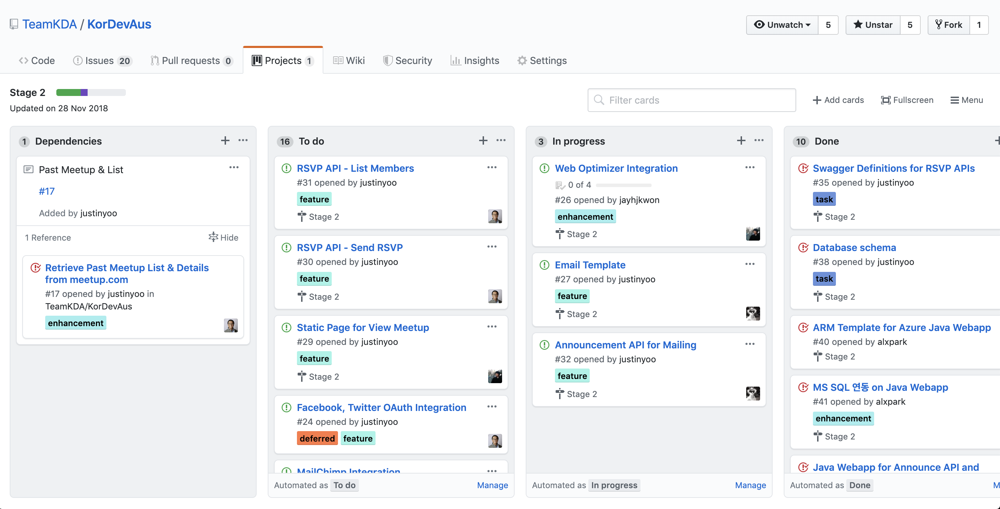

## Local development

#### Pre-requisites

-   nvm
-   yarn
-   Run below commands

```
nvm install (v16.5.0)
nvm use (Just in case you are using many different versions of node)
npm install -g gatsby-cli yarn
yarn install
yarn develop
```

Open [http://localhost:8000](http://localhost:8000) for UI
Open [http://localhost:8000/\_\_\_graphql](http://localhost:8000/___graphql) for Grqphql client

## Development

Gatsby enables to generate static html from md files.
In order to add new KDA Meetup page,

-   go to `src/content` folder.
-   clone the latest `meetup_##.md` file with incresed number.
-   update the contents for new meetup and git commit & push
-   run `gatsby develop` and check everything updated in `http://localhost:8000`
-   build `gatsby build` it

```
gatsby develop
```

-   local test : http://localhost:8000/

## Build

Build changed contents in local and upload all static files into server.

```
gatsby build
```

-   gatsby generates static website files into `/public` folder.
-   upload all files in public into server side.

## Publish into AWS

Now Github Action is building and publishing to KDA Website automatically.

-   .github/workflows

## Tech stack

-   React
-   Gatsby
-   SASS

## How to create new post

Open `src/components` folder and create a new mark down file by copying existing one

## Contribution

1. Find what to add/fix/update in the [Project dashboard](https://github.com/TeamKDA/KorDevAus/projects/2)

-   High priorities
    -   User signup using Firebase Auth SDK
    -   Make a RSVP
    -   Show meetup history
    -   Provides nice previews when sharing on social medias



2. Fork the repo you want to contribute
3. Send a beautiful PR

-   Please just make a PR small so that easy to review it

## System architecture

[System architecture](./architecture.md)
