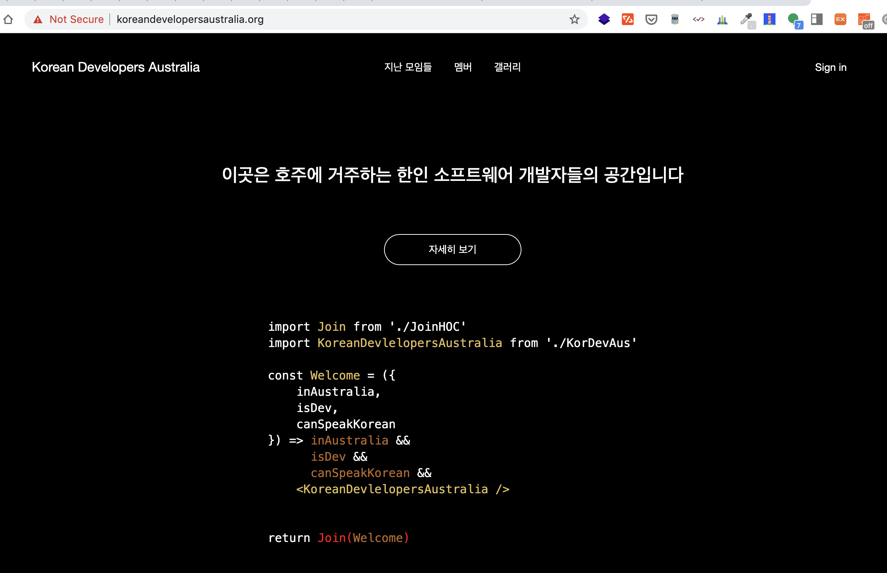
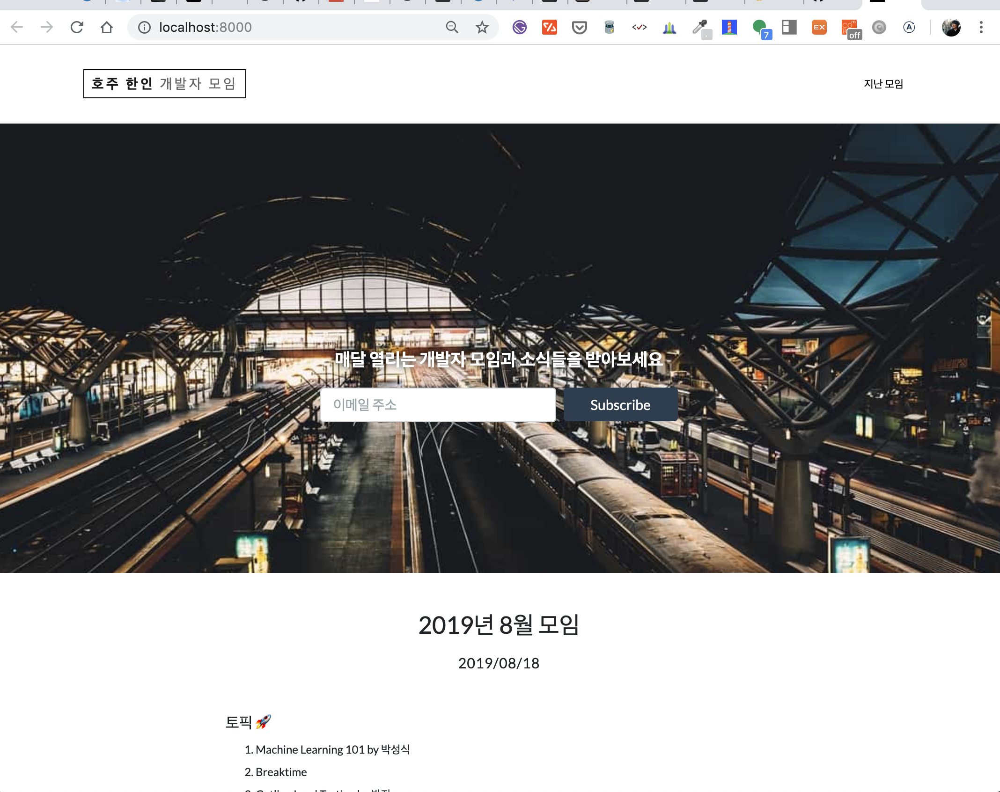
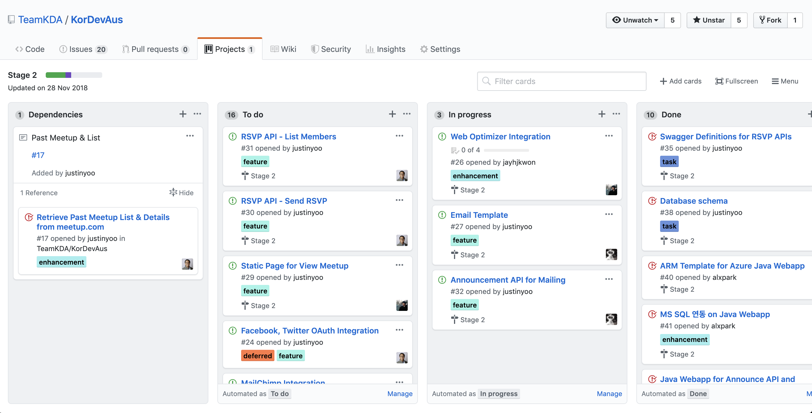

## High level architecture

#### ~~User API~~
- What it does? 채워주세요
- Repo: [KorDevAus-User-API](https://github.com/TeamKDA/KorDevAus-User-API)
- 변경 사항이 있으면 채워주세요

#### ~~Database management~~
- What it does? 채워주세요
- Repo: [KorDevAus-Database](https://github.com/TeamKDA/KorDevAus-Database)
- Entity Framework Code First
- 변경 사항이 있으면 채워주세요

#### ~~RSVP API~~
- What it does? 채워주세요
- Repo: [KorDevAus-RSVP-API](https://github.com/TeamKDA/KorDevAus-RSVP-API)
- 변경 사항이 있으면 채워주세요

#### Announcement API
- What it does? 
  - This api is a proxy api to connect with MailChimp APIs
  - It also persists API data on MySQL, like as RSVP
  - KDA UI currently uses this API for RSVP temporary
- Repo: [KorDevAus-Announcement-API](https://github.com/TeamKDA/KorDevAus-Announcement-API)
- Java 1.8+, SprintBoot, Apache Camel(for REST) + Swagger + Mysql 
- [Jasypt](http://www.jasypt.org) is used to encrypt credentials and `APP_ENC` env parameter is required on runtime environment to up and running the app. (Ask to Admin to get this) 
- Runtime : Azure Web App or Cloud Foundary(Pivotal Web App) or any jvm 1.8+ runtime
- Currently api is temporary running on Cloud Foundary for 8 months free

#### UI
- Web interface for https://koreandevelopersaustralia.org

- Old
  - Repo: [KorDevAus](https://github.com/TeamKDA/KorDevAus)
  - ASP.NET CORE2, jQuery
  - Traditional Server rendering web site
  - Azure Web App 
  

- New
  - Repo: [kor-dev-aus](https://github.com/TeamKDA/kor-dev-aus)
  - React, Gatsby, GraphQL
  - Static web site running on Netlify
  

- Benefits of changing platform
  - Cost 
  - Modern stack

## Where we are heading?
- Less cost required cloud services e.g. Netlify, Firebase
- Simple architecture to understand so that contributors easy to pickup

## Contribution
1. Find what to add/fix/update in the [Project dashboard](https://github.com/TeamKDA/KorDevAus/projects/2)
  - High priorities
    - User signup using Firebase Auth SDK
    - Make a RSVP
    - Show meetup history
    - Provides nice previews when sharing on social medias

2. Fork the repo you want to contribute
3. Send a beautiful PR
  - Please just make a PR small so that easy to review it

